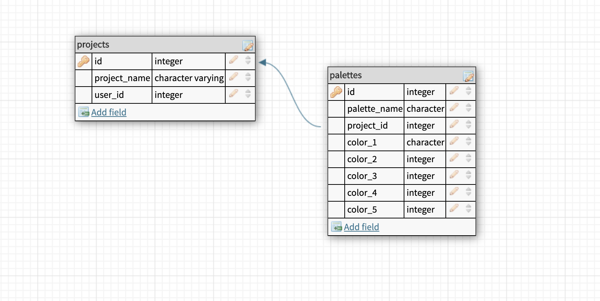

## Palette Picker BE

## Collaborators 
- [Allison Wagner](https://github.com/allisonjw)
- [Jessie Le-Ho](https://github.com/Jessiewithani)

### [Sprint Project Board](https://github.com/allisonjw/palette-picker-BE/projects/1)

---

### [Front End Repo](https://github.com/allisonjw/palette-picker-FE)

--- 

### [Live Application]()

---

### [Heroku Deployment of BE](https://palette-of-colors-picker.herokuapp.com/)

---

### Tech Used

This application was built using the following technologies:

- Node.js
- Express.js
- Knex
- PostgreSQL

---

### Initial Design of Schema Database

---

### API Endpoints
----

All Endpoints for the Projects Database

<table>
  <thead>
    <tr>
      <th>Purpose</th>
      <th>URL</th>
      <th>Verb</th>
      <th>Request Body</th>
      <th>Sample Response (Happy Path)</th>
      <th>Sample Response (Sad Path)</th>
    </tr>
  </thead>
  <tbody>
    <tr>
      <td>Get all projects</td>
      <td><code class="language-plaintext highlighter-rouge">`/api/v1/projects`</code></td>
      <td>`GET`</td>
      <td>N/A</td>
      <td><code class="language-plaintext highlighter-rouge"> [{
        "id": 9,
        "project_name": "Jessie's House",
        "user_id": 5
    },
    {
        "id": 10,
        "project_name": "Dream Bath",
        "user_id": 5
    },
    {
        "id": 11,
        "project_name": "Allison's House",
        "user_id": 6
    }, {}, {}, {}]</code></td>
      <td>Status 500: No Projects Found</td>
    </tr>
    <tr>
      <td>Get project by id: </td>
      <td><code class="language-plaintext highlighter-rouge">`/api/v1/projects/:id/`</code></td>
      <td>`GET`</td>
      <td>N/A</td>
      <td><code class="language-plaintext highlighter-rouge">{
        "id": 12,
        "project_name": "Art Project",
        "user_id": 6
    }</code></td>
      <td>Status 404: Project Not Found</td>
    </tr>
    <tr>
      <td>Add a new project</td>
      <td><code class="language-plaintext highlighter-rouge">`/api/v1/projects`</code></td>
      <td>`POST`</td>
      <td><code class="language-plaintext highlighter-rouge">{ project_name: &lt;String&gt; }</code></td>
      <td><code class="language-plaintext highlighter-rouge">{
        "id": 21,
        "project_name": "Art Project",
        "user_id": 6
    }</code></td>
      <td>Status 422: The expected format is project_name: <String> You're missing a project_name property.</td>
    </tr>
    <tr>
      <td>Update an existing project based on id</td>
      <td><code class="language-plaintext highlighter-rouge">`/api/v1/projects/:id`</code></td>
      <td>`PATCH`</td>
      <td><code class="language-plaintext highlighter-rouge">{ project_name: &lt;String&gt; }</code></td>
      <td>204 status code [property] updated</td>
      <td>Status 404: Project Number 22 Could Not Be Found</td>
    </tr>
    <tr>
      <td>Delete an existing project based on id</td>
      <td><code class="language-plaintext highlighter-rouge">`/api/v1/projects/:id/`</code></td>
      <td>`DELETE`</td>
      <td>N/A</td>
      <td>204 status code (NO CONTENT in response body)</td>
      <td>Status 404: Project Number 22 Could Not Be Found</td>
    </tr>
  </tbody>
</table>

---

All Endpoints for the Palettes Database

<table>
  <thead>
    <tr>
      <th>Purpose</th>
      <th>URL</th>
      <th>Verb</th>
      <th>Request Body</th>
      <th>Sample Response (Happy Path)</th>
      <th>Sample Response (Sad Path)</th>
    </tr>
  </thead>
  <tbody>
    <tr>
      <td>Get all plattes</td>
      <td><code class="language-plaintext highlighter-rouge">`/api/v1/palettes`</code></td>
      <td>`GET`</td>
      <td>N/A</td>
      <td><code class="language-plaintext highlighter-rouge"> [{
        "id": 9,
        "palette_name": "Neutrals",
        "project_id": 10,
        "color_1": "#D6B28D",
        "color_2": "#C1A281",
        "color_3": "#E5CCA9",
        "color_4": "#BFA98B",
        "color_5": "#A88F77",
        "timestamps": null
    },
    {
        "id": 10,
        "palette_name": "Sailing Away",
        "project_id": 9,
        "color_1": "#17E2B4",
        "color_2": "#143472",
        "color_3": "#060E1E",
        "color_4": "#A3AFC6",
        "color_5": "#E52522",
        "timestamps": null
    }, {}, {}, {}]</code></td>
      <td>Status 500: No Palettes Found</td>
    </tr>
    <tr>
      <td>Get palette by id: </td>
      <td><code class="language-plaintext highlighter-rouge">`/api/v1/palettes/:id/`</code></td>
      <td>`GET`</td>
      <td>N/A</td>
      <td><code class="language-plaintext highlighter-rouge">{
        "id": 12,
        "palette_name": "Mountain Dreams",
        "project_id": 12,
        "color_1": "#C6CDB7",
        "color_2": "#ECB78A",
        "color_3": "#5A7673",
        "color_4": "#BBB493",
        "color_5": "#96B2B4",
        "timestamps": null
    }</code></td>
      <td>Status 404: Project Not Found</td>
    </tr>
    <tr>
      <td>Add a new palette</td>
      <td><code class="language-plaintext highlighter-rouge">`/api/v1/palettes`</code></td>
      <td>`POST`</td>
      <td><code class="language-plaintext highlighter-rouge">{ palette_name: &lt;String&gt;, color_1: &lt;String&gt;, color_2: &lt;String&gt;, color_3: &lt;String&gt;, color_4: &lt;String&gt;, color_5: &lt;String&gt; }</code></td>
      <td><code class="language-plaintext highlighter-rouge">{
        "id": 11,
        "palette_name": "Modern",
        "project_id": 11,
        "color_1": "#AE2D49",
        "color_2": "#21354A",
        "color_3": "#4EB47A",
        "color_4": "#C9CFC8",
        "color_5": "#F6C876",
        "timestamps": null
    }</code></td>
      <td>Status 422: The expected format is: { palette_name: <String>, color_1: <String>, color_2: <String>, color_3: <String>, color_4: <String>, color_5: <String>. Your're missing a palette_name property.</td>
    </tr>
    <tr>
      <td>Update an existing palette based on id</td>
      <td><code class="language-plaintext highlighter-rouge">`/api/v1/palettes/:id`</code></td>
      <td>`PATCH`</td>
      <td><code class="language-plaintext highlighter-rouge">{ palette_name: &lt;String&gt; }</code></td>
      <td>204 status code [property] updated</td>
      <td>Status 404: Palette Number 22 Could Not Be Found</td>
    </tr>
    <tr>
      <td>Delete an existing palette based on id</td>
      <td><code class="language-plaintext highlighter-rouge">`/api/v1/palettes/:id/`</code></td>
      <td>`DELETE`</td>
      <td>N/A</td>
      <td>204 status code (NO CONTENT in response body)</td>
      <td>Status 404: Palette Number 22 Could Not Be Found</td>
    </tr>
  </tbody>
</table>

---
